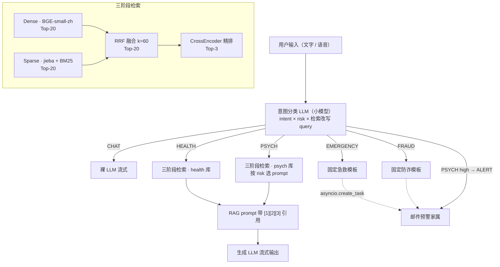

# ElderCare 银发陪伴智能体

面向独居老人的 AI 陪伴助手。基于 **FastAPI + 动态路由 RAG** 构建，将闲聊 / 健康咨询 / 心理倾诉 / 医疗急症 / 电信诈骗五类意图自动分诊；**三阶段检索**（dense + sparse → RRF → CrossEncoder rerank）保证 RAG 质量，**答案附带可点击引用源**使回答完全可解释；高风险场景实时邮件通知家属。

**在线 Demo**：https://huggingface.co/spaces/bluegum/eldercare-rag
登录页点击「一键体验演示账号」，可直接查看预置的一周陪伴记录与管理仪表盘。

## 核心特性

| 模块 | 能力 |
|---|---|
| 动态路由 RAG | 5 类意图分诊，意图 × 风险 × 检索改写，一次 LLM 调用同时输出 |
| 多轮检索改写 | 追问（"那平时吃什么好？"）自动改写成独立检索问题，多轮不掉链 |
| 三阶段检索 | 向量 + BM25 双路召回 → RRF 融合 → BGE-reranker 精排 |
| 引用溯源 | LLM 输出 `[1] [2]` 标号，点击徽章跳转底层 chunk 并高亮，附来源/主题标签；检索快照随消息落库，历史回看同样可溯源 |
| Agent 执行轨迹 | 演示模式下逐阶段点亮流水线时间线（分诊 → 双路召回 → RRF → 精排 → 生成），含各阶段耗时 |
| 对比模式 | 同一问题双栏同时流式输出「完整 Agent」vs「裸 LLM」，直观展示 RAG 收益 |
| 账号与历史 | 登录 / 注册 / demo 一键体验（纯标准库 PBKDF2 + 服务端 token），历史会话随时回看续聊；登录态走 Bearer 头，兼容 HF Space 跨站 iframe |
| 异步预警 | 高危场景 `asyncio.create_task` 派发邮件，不阻塞流式响应 |
| 三级日志 | INFO / WARN / ALERT，避免家属告警疲劳 |
| 管理仪表盘 | `/admin` 零依赖 SVG 图表：意图分布、级别分布、14 天趋势、最近告警，`ADMIN_TOKEN` 鉴权 |
| 适老化与移动端 | Web Speech API 中文语音输入输出、三档大字号、移动端双排顶栏适配，零依赖、零成本 |
| 量化评测 | LLM-as-judge 在 30 条评测集上对比三条检索流水线 |

## 评测结果

30 条评测集 × 3 条流水线 × 3 个 RAGAS 风格指标（LLM-as-judge）：

| 指标 | 纯向量 | +rerank | +hybrid+rerank |
|---|---|---|---|
| **Context Precision** | 75.6% | **78.9%** | 77.8% |
| Faithfulness | 83.3% | 80.0% | 76.7% |
| Answer Relevance | 4.63/5 | 4.60/5 | 4.70/5 |

Rerank 取得 **+3.3 pts** 的实证收益；Hybrid 在问答用词高度对齐的语料上无显著增益（分析见 `scripts/eval_rag.py` 报告）。

## 架构



SSE 事件流按阶段推送（`stage` / `intent` / `retrieved` / `message` / `done`），前端「执行轨迹」面板实时点亮每一步并显示耗时——演示模式一开，架构自己会说话。

## 技术栈

- **后端**：Python 3.11 / FastAPI / Pydantic / SSE 流式
- **向量库**：ChromaDB（HNSW + cosine）
- **Embedding**：BAAI/bge-small-zh-v1.5（本地）
- **Reranker**：BAAI/bge-reranker-base（本地 CrossEncoder，`asyncio.to_thread` 出线程池）
- **稀疏检索**：rank-bm25 + jieba（磁盘 pickle 缓存，冷启动 <1s）
- **LLM**：Qwen via OpenRouter（生成 `qwen3.7-plus`，分类 `qwen3.5-flash`，env 一行可换）
- **账号体系**：标准库 PBKDF2-SHA256 + 服务端 token + httponly cookie（零新依赖）
- **数据**：SQLite + aiosmtplib + openpyxl
- **前端**：原生 HTML / CSS / JS + Web Speech API，统一描边 SVG 图标，零框架零构建

## 本地运行

```bash
# 1. 安装依赖
pip install -r requirements.txt

# 2. 配置环境变量
cp .env.example .env
# 在 .env 中填入 OPENROUTER_API_KEY

# 3. 构建知识库（首次必做）
python scripts/ingest.py
python scripts/ingest_psych.py

# 可选：接入真实开源数据集
python scripts/ingest_dataset.py \
    --hf-dataset michaelwzhu/ChatMed_Consult_Dataset \
    --collection health --question-field query --answer-field response \
    --max-rows 10000

# 4. 启动服务
uvicorn app.main:app --reload --port 8000
```

访问 http://localhost:8000 ，右上角星形按钮开启演示模式（执行轨迹 + 对比模式 + 仪表盘入口）。

**demo 账号**：启动时自动创建 `demo / demo2026`（可用 env 改），预置覆盖五类意图的一周对话记录。

## 知识库

| Collection | 数据集 | 条数 |
|---|---|---|
| `health` | [michaelwzhu/ChatMed_Consult_Dataset](https://huggingface.co/datasets/michaelwzhu/ChatMed_Consult_Dataset) | 10000 |
| `psych` | [liuzj288/PsyQA](https://huggingface.co/datasets/liuzj288/PsyQA) | 5000 |

## 环境变量

| 变量 | 必填 | 说明 |
|---|---|---|
| `OPENROUTER_API_KEY` | 是 | OpenRouter API key（HF Spaces 在 Secrets 配置） |
| `CHAT_MODEL` | 否 | 生成模型，默认 `qwen/qwen3.7-plus` |
| `INTENT_MODEL` | 否 | 意图分类模型，默认 `qwen/qwen3.5-flash-02-23` |
| `ADMIN_TOKEN` | 建议 | 管理端口令；不设则 /admin 接口无鉴权（仅限本地开发） |
| `DEMO_USERNAME` / `DEMO_PASSWORD` | 否 | demo 账号，默认 `demo / demo2026` |
| `SMTP_HOST/USER/PASSWORD/...` | 否 | 邮件预警，未配置时打印到 stdout |

## 项目结构

```
app/                # 后端
├── main.py         # FastAPI 入口（后台构建 BM25，healthz 秒开）
├── intent.py       # 意图分类 + 多轮检索改写（一次调用三产出）
├── retrieval.py    # 三阶段检索编排（retrieve_events 分阶段流式）
├── bm25_store.py   # BM25 稀疏索引（pickle 缓存）
├── reranker.py     # CrossEncoder 精排（懒加载）
├── vector_store.py # Chroma 包装
├── security.py     # PBKDF2 密码哈希 + 登录态依赖（纯标准库）
├── demo_seed.py    # demo 账号 + 预置演示对话
├── notifier.py     # 异步邮件预警
├── templates.py    # Prompt 与模板
└── routers/        # /agent /chat /auth /conversations /admin

static/             # 前端（index.html + admin.html 仪表盘，零依赖）
scripts/            # 数据接入与评测
```

## 评测

```bash
python scripts/eval_intent.py    # 意图分类准确率
python scripts/eval_rag.py       # 三条流水线 RAGAS 风格对比
```

报告输出至 `reports/eval_<时间戳>.{json,md}`。

## 免责声明

本项目仅用于学习与技术演示，**不能替代医生诊断或心理咨询师**。模型输出仅供参考，紧急情况请拨打 120 或心理援助热线 **400-161-9995**。

## 数据致谢

- [ChatMed_Consult_Dataset](https://huggingface.co/datasets/michaelwzhu/ChatMed_Consult_Dataset)（michaelwzhu）
- [PsyQA](https://huggingface.co/datasets/liuzj288/PsyQA)（liuzj288 社区镜像 / 原 thu-coai/PsyQA）
- [BGE 系列模型](https://huggingface.co/BAAI)（BAAI）

## License

[MIT](LICENSE)
